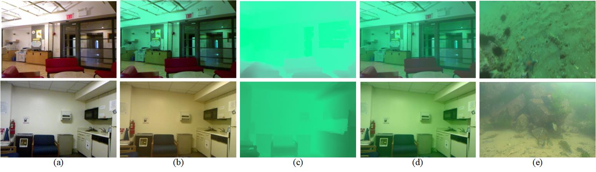
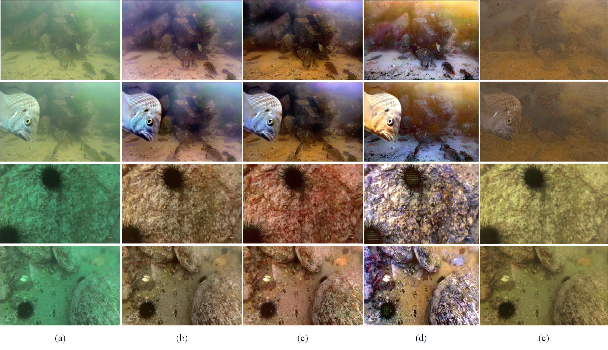

### Resources
- Implementation of **RUIR-DPGAN** (paired) 
- Implementation: PyTorch 1.6 (Python 3.8)
### Datasets 
1. In-air RGBD data: [NYU Depth Dataset V1](https://cs.nyu.edu/~silberman/datasets/nyu_depth_v1.html), [NYU Depth Dataset V2](https://cs.nyu.edu/~silberman/datasets/nyu_depth_v2.html)

2. Underwater images: [[Baidu Cloud Link](https://pan.baidu.com/s/1lC5YIkEtGmtl-m1V7TQNkw)] [[Google Drive](https://drive.google.com/open?id=1S2T5gZbdNe9KvVqGf-Neul3clRrpymPo)]

3. UnderWater-Type1: [[Google Drive](https://drive.google.com/file/d/1xa6B5200UKC63OBp7EMSCeK5o8b1sKJr/view?usp=sharing)]

4. UnderWater-Type2:[[Google Drive](https://drive.google.com/file/d/1lmrR5avRMPll0Bq3dreeRfLGMcQ5u2N-/view?usp=sharing)]

5. Edge pretrained model:[[Google Drive](https://drive.google.com/file/d/161MW2bGRoHY8Le9IDQQVol3FE3xin1L3/view?usp=sharing)]
### Usage
- Download the data, setup data-paths in the [config files](configs)
- Use the training scripts for paired training of DP-GAN
- Use the [evaluate.py](evaluate.py) script for evaluate
- A sample model is provided in [models](models)  

| Simulation Underwater image |
|:--------------------|
|  |

| Simulation image restoration |
|:--------------------|
|  |

| Enhanced real underwater imagery |
|:--------------------|
|  |

| Enhanced underwater video |
|:--------------------|
|  |

### Acknowledgements
- https://github.com/xahidbuffon/FUnIE-GAN
